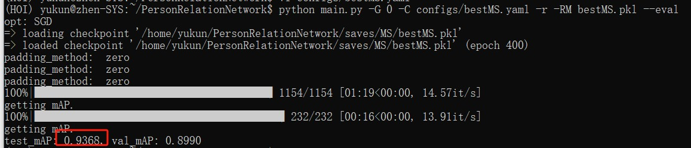
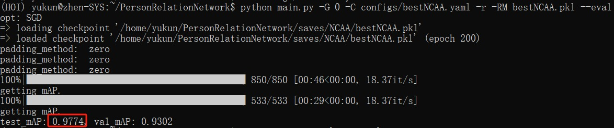

# Learning Relation Models to Detect Important People in Still Images

This is an official pytorch implementation of our paper: [Learning Relation Models to Detect Important People in Still Images](https://ieeexplore.ieee.org/document/9907874).


People Relation Network (PRN) can accurately identify the important people by considering the relations among people and the relations between people and underlying events. Specifically, PRN consists of three modules (i.e., the feature representation, relation and classification modules) to extract visual features, model relations and estimate people’s importance, respectively. Experiments on the Multi-Scene Important People (MS) and NCAA Basketball Image (NCAA) datasets show that PRN achieves state-of-the-art performance and generalizes well when available data is limited.

## Dependency

System: Ubuntu 18.04

```
conda create -n PRN python=3.9.2
conda activate PRN
pip install torch==1.8.1+cu111 torchvision==0.9.1+cu111 torchaudio==0.8.1 -f https://download.pytorch.org/whl/torch_stable.html
pip install scipy numpy pyyaml pillow tqdm
```

## Datasets

You can download the MS dataset and the NCAA dataset from this link using the code. 

### MS dataset

link：https://pan.baidu.com/s/1mjfELWkGABH_4_OpTebDaw 
code：9dal

### NCAA dataset

link：https://pan.baidu.com/s/1cq8_upjGtoEsGzmg50i8Kg 
code：8pv2

### Data preparation

Before evaluation or training, you have to preprocess the data using preprocess_datasets.py.

**NOTICE: before running the script, you have to set the paths in line 97 to 106.**

To preprocess the MS dataset:

`python preprocess_datasets.py --dataset MS --need_multi_vip`

To preprocess the NCAA dataset:

`python preprocess_datasets.py --dataset NCAA --need_multi_vip`

### Config preparation

You need to set the paths in the example configs. First, you need to set the models_path:

`models_path: /path/to/code/PeopleRelationNetwork/packages/models`

Second, you need to set the path of data:

```
MS:/path/to/MS/processed(multi).pkl
NCAA:/path/to/NCAA/processed(multi).pkl
```


## Evaluation

You can download the trained models from the links and the codes.

### MS

link：https://pan.baidu.com/s/1py647zl9z8ANhGU3OuUPnA 
code：6pn7

### NCAA

link：https://pan.baidu.com/s/1JZqwbadg9h6D6yo4uXd_-Q 
code：dqvl

You need to move the model trained on MS dataset to: /path/to/code/PeopleRelationNetwork/saves/MS/bestMS.pkl.

Similarly, for the NCAA dataset, you need to move the trained model to: /path/to/code/PeopleRelationNetwork/saves/NCAA/bestNCAA.pkl.

you can evaluate the trained models:

`python main.py -G 0 -C /path/to/config/bestMS.yaml -r -RM bestMS.pkl --eval`

`python main.py -G 0 -C /path/to/config/bestNCAA.yaml -r -RM bestNCAA.pkl --eval`

Following the process you should successfully reproduce the exactly same results that reported in the paper (I have verified this in my server). 

Specifically, for the MS dataset:



And, for the NCAA dataset:



### Train your own model from scratch

To train a new model, you should first copy the example config and modify the name of model. (e.g., from BestMS to reproduceMS). Then you can train the model:

`python main.py -G 0 -C /path/to/your_config.yaml`.

Although we try our best to ensure the reproducibility by setting the random seed of random, pytorch and numpy, you can still get a different result since the variances of running environment. However, running multiple times with different seeds should get a similar result.

### Citation

If our code or paper helps your research, please cite our paper:

bib:

```
@article{Qiu2022PRN,
  title={Learning Relation Models to Detect Important People in Still Images},
  author={Qiu, Yu-Kun and Hong, Fa-Ting and Li, Wei-Hong and Zheng, Wei-Shi},
  journal={IEEE Transactions on Multimedia},
  year={2022},
  publisher={IEEE}
}
```

